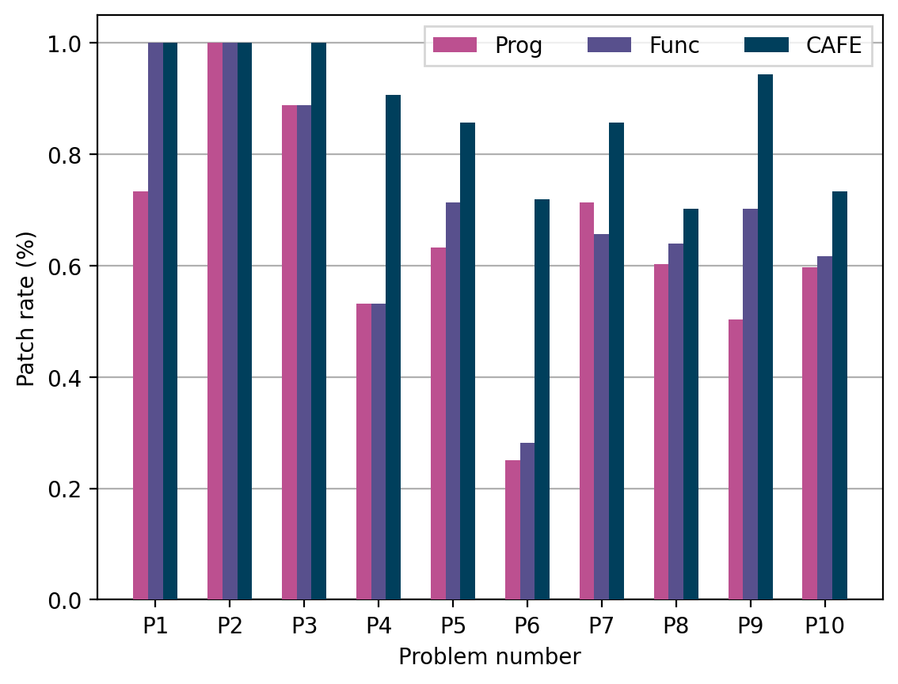

# LearnML

LearnML is a framework for providing personalized feedbacks on functional programming assignments written by OCaml. Our framework consists of the following three tools:

* **FixML** ([OOPSLA_18](https://dl.acm.org/doi/10.1145/3276528)) : **search-based** automated feedback generator
* **TestML** ([OOPSLA_19](https://dl.acm.org/doi/10.1145/3360614)): logical error detector using **counter-example generation**
* **CAFE** ([FSE_21](./FSE21.pdf)): **context-aware** and **data-driven** feedback generator

All the tools are licensed under the [MIT license](LICENSE).

## Installation
We provide a simple way to install LearnML:
* A VirtualBox image containing all resources to reproduce the main results (Table1 and Figure6) of our paper: [FSE21_CAFE_artifacts.tar.gz](https://drive.google.com/file/d/1aqHfwld88AiZTy5Dcu0Th3nmnaVd5eyZ/view?usp=sharing) ([Zenodo DOI](https://zenodo.org/record/5084000#.YOvg65MzaBQ))
   * Ubuntu ID/PW: cafe/cafe
   
Please see [INSTALL.md](./INSTALL.md) for full installation instructions.

## Artifact information

The VirtualBox image contains the following contents in the directory `~/FSE21_artifacts/`
1. `benchmarks` contains our benchmarks consisting of submissions for 10 programming exercises, TA's golden solution, and test cases with test driver:
    * `C` contains 3,547 reference solutions which pass test cases.
    * `I` contains 664 incorrect submissions which cannot pass test cases.
    * `ta_solutions` contains TA's reference solutions that are used as inputs for FixML and TestML.
    * `testcases` contains test cases used in evaluation, and testing driver files.
 
2. `engine` contains all several common source codes (e.g., main-driver, language definition, utility functions, etc) and four subdirectories: 
    * `FixML` contains the implementation of FixML.
    * `TestML` contains the implementation of TestML.
    * `Data-driven` contains the implementation of three data-driven approaches (CAFE, fucntion-level SARFGEN, and program-level SARFGEN). The most important tasks of CAFE is included in the following file:
      * `callGraph.ml` contains the implementation of our 0-CFA call graph extraction (Section 4.1)
      * `selector.ml` contains the implementation of function context-aware matching (Section 4.1)
      * `repair_template.ml` and `extractor.ml` contains the definition of repair template and implementation of template extraction (Section 4.2.1)
      * `alias.ml`, `complete.ml`, and `update.ml` are about edit scripts generation (Section 4.2.2)
      * `repairer.ml` contains the overall patch generation algorithm of CAFE (section 4.2.3)
    * `models` contains the preprocessed data (call-graph) of reference solutions. When new solutions are given to our data-driven feedback generator, it stores the obtained call-graph in here.
    
3. `run.py` is a python script for running all benchmarks by several options.
4. `table.py` is a python script for visualizing evaluation result.
5. `result` contains all results obtained by running `run.py`. Since running the script takes a long time, we also provide the pre-excuted results on our experiemntal environment (**iMac with Intel i5 CPU and 16GB memory**).

## Reproducing the results presented in the paper
Here we explain how to reproduce our main results (i.e., Table1, Table2, and Figure6). We do not provide the user study result because of the privacy issues.

### Reproducing the results via provided results
1. To reproduce the evaluation results, go to the directory: `~/FSE21_artifacts/` and run the script by: ``` python3 table.py result ``` 
    * Table1 is created from resulting logs in `result/cafe` and `result/fixml`
    * Table2 is created from resulting logs in `result/cafe` and `result/cafe2`
    * Figure6 is created from  resulting logs in `result/cafe`, `result/func`, and `result/prog`
2. If it is properly done, you can see the following results:
    * `result/table1.txt` shows the following table:
    
    ```
    |   No | Problem   |   # Wrong |   # Correct | LOC (min-max)   |   Time (FixML) |   #Fix (FixML) |   Time (CAFE) |   #Fix (CAFE) |
    |------+-----------+-----------+-------------+-----------------+----------------+----------------+---------------+---------------|
    |    1 | max       |        45 |         171 | 5(1-9)          |            0.3 |             42 |           0   |            45 |
    |    2 | mem       |        19 |         117 | 9(5-13)         |            3.1 |             12 |           0   |            19 |
    |    3 | mirror    |         9 |          88 | 6(3-9)          |            0.1 |              8 |           0   |             9 |
    |    4 | sigma     |        32 |         704 | 4(2-10)         |            1.6 |             17 |           2.1 |            29 |
    |    5 | iter      |        49 |         454 | 5(2-11)         |           11.8 |             26 |           1.1 |            42 |
    |    6 | uniq      |        32 |         125 | 12(5-24)        |            4.1 |             10 |           3   |            23 |
    |    7 | nat       |        35 |         412 | 13(7-23)        |           23.3 |             18 |           1   |            30 |
    |    8 | formula   |       111 |         597 | 29(13-64)       |            1.5 |             47 |           0.5 |            78 |
    |    9 | lambda    |       141 |         661 | 20(6-47)        |            1.5 |             40 |           1.8 |           133 |
    |   10 | diff      |       191 |         218 | 29(7-114)       |            1.1 |             44 |           3   |           140 |
    |      | Total     |       664 |        3547 | 20(1-114)       |            3.9 |            264 |           1.6 |           548 |
    ```
    
    The table slightly differs to the one presented in the paper. First, the number of patches generated by FixML is higher than reported result. This is because the table in the paper did not report 30 incorrect patches generated by FixML. Second since we fixed some minor implementation issues of our data-driven feedback generator, the performance of CAFE is better than when writing the paper. We will report the changes in the final paper.
    
    * `result/table2.txt` shows the following table:
    
    ```
    |   No | Problem   |   #Test (w/ test) |   #Fix (w/ test) |   Time (w/ test) |   #Test (w/o test) |   #Fix (w/o test) |   Time (w/o test) |
    |------+-----------+-------------------+------------------+------------------+--------------------+-------------------+-------------------|
    |    1 | max       |                11 |               45 |              0   |                  2 |                45 |             120.2 |
    |    2 | mem       |                10 |               19 |              0   |                  3 |                19 |             120.1 |
    |    3 | mirror    |                10 |                9 |              0   |                  2 |                 9 |             120.1 |
    |    4 | sigma     |                10 |               29 |              2.1 |                  2 |                29 |             124   |
    |    5 | iter      |                11 |               42 |              1.1 |                  3 |                42 |             122.3 |
    |    6 | uniq      |                20 |               23 |              3   |                  3 |                23 |             124.1 |
    |    7 | nat       |                10 |               30 |              1   |                  3 |                30 |             121.1 |
    |    8 | formula   |                18 |               78 |              0.5 |                  4 |                78 |             130.8 |
    |    9 | lambda    |                33 |              133 |              1.8 |                  3 |               133 |             122.5 |
    |   10 | diff      |                28 |              140 |              3   |                  5 |               141 |             133.5 |
    ```
    
    The table slightly differs to the one presented in the paper. First, the number of patches generated by advanced CAFE is lower than reported result. Second the elappsed time is slightly longer.
    
    * `result/figure6.png` shows the following graph:

     
    
    As we mentioned above, the performace of data-driven feedback generation engine was changed slightly because of the minor bug fix. Therefore, compared with the paper, there are some minor diffrences in the graph. We will report the changes in the final paper.

### Running the artifact
Since someone may want to run our artifact on their own, we also explain how to run the arfifact and show the result. 
1. To build our engine type the command:```cd engine; ./build```
2. Go to the directory: `~/FSE21_artifacts/` and run the script by: ``` python3 run.py ```
    * This script runs all submission with four feedback generators (CAFE, FixML, function-level SARFGEN, and program-level SARFGEN)
    * The results is generated in `result[time]/[tool_name]/[problem]/[submission]`:
      * `original.ml` is original submssion.
      * `patch.ml` is a patch obtained by modifying original.ml. If a system fails to repair, only None is written.
      * `result.txt` contains elapsed time and size of patch (if it calculated).
3. After running `run.py`, type the script: ``` python3 table.py [result_directory] ```. It will show the table and graph according to the evaluation result.
